# AWS CDK Cognito Protected API Demo

This project demonstrates how to create a protected API using AWS CDK with Cognito authentication. It sets up a complete serverless infrastructure including API Gateway, Lambda, and Cognito User Pool. To test the API, we'll configure and use Postman with OAuth 2.0 to sign in and get an access token. This can be an easy way to test your API without setting up a frontend while still using JWTs for authentication.

## Architecture

The infrastructure consists of three main components:

**Cognito User Pool**: Handles user authentication

- Email-based sign-up and sign-in
- Password policies and email verification
- OAuth 2.0 flows support
- Hosted UI for sign-up/sign-in

**API Gateway**: Protected REST API

- Cognito authorizer integration
- Single GET endpoint `/hello`
- JWT token validation

**Lambda Function**: Backend logic

- Returns protected data
- Includes user information from Cognito claims

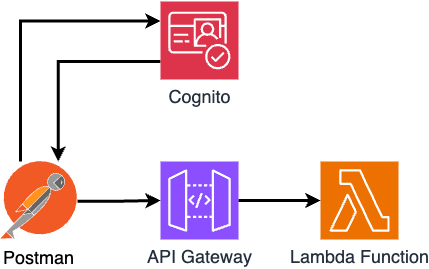

## Infrastructure Code Overview

### Cognito Setup (CognitoConstruct)

```typescript
this.userPool = new UserPool(this, "UserPool", {
  userPoolName: "postman-demo-user-pool",
  selfSignUpEnabled: true,
  signInAliases: { email: true },
  standardAttributes: {
    email: { required: true, mutable: true },
    givenName: { required: true, mutable: true },
  },
  passwordPolicy: {
    minLength: 8,
    requireLowercase: true,
    requireUppercase: true,
    requireDigits: true,
    requireSymbols: true,
  },
  signInCaseSensitive: false,
  userVerification: {
    emailStyle: VerificationEmailStyle.LINK,
    emailSubject: "Verify your email for our demo app!",
  },
});

this.userPoolClient = new UserPoolClient(this, "UserPoolClient", {
  userPool: this.userPool,
  oAuth: {
    flows: {
      authorizationCodeGrant: true,
      implicitCodeGrant: true,
    },
    scopes: [OAuthScope.EMAIL, OAuthScope.OPENID, OAuthScope.PROFILE],
    callbackUrls: [
      "http://localhost:3000/callback",
      "https://oauth.pstmn.io/v1/callback",
    ],
  },
  preventUserExistenceErrors: true,
  accessTokenValidity: Duration.minutes(60),
  idTokenValidity: Duration.minutes(60),
  refreshTokenValidity: Duration.days(30),
});
```

### API Gateway Setup (ApiGatewayConstruct)

```typescript
const api = new RestApi(this, "ProtectedApi", {
  restApiName: "Protected API Demo",
  description: "API Gateway with Cognito authorization",
});

const authorizer = new CognitoUserPoolsAuthorizer(this, "ApiAuthorizer", {
  cognitoUserPools: [props.userPool],
  authorizerName: "CognitoAuthorizer",
  identitySource: "method.request.header.Authorization",
  resultsCacheTtl: Duration.minutes(5),
});

const resource = api.root.addResource("hello");
resource.addMethod("GET", new LambdaIntegration(props.lambdaFunction), {
  authorizer: authorizer,
  authorizationType: AuthorizationType.COGNITO,
  authorizationScopes: ["email", "openid", "profile"],
});
```

## Understanding Cognito Tokens & API Security

### Token Flow

When a user authenticates through Cognito, three different tokens are issued:

1. **ID Token**: A JWT containing user identity claims (profile info, email, etc.)
2. **Access Token**: A JWT specifically for authorizing API requests
3. **Refresh Token**: Used to obtain new ID and Access tokens when they expire

### How API Gateway Authorization Works

1. Client obtains tokens through Cognito authentication
2. Client includes Access Token in API request (`Authorization: Bearer <token>`)
3. API Gateway:
   - Validates token signature using Cognito's public keys
   - Checks token expiration
   - Verifies audience (client_id) and issuer (Cognito User Pool)
   - Passes user claims to Lambda in `event.requestContext.authorizer`

### JWT Token Structure

Each token is a JSON Web Token (JWT) with three parts:

```
header.payload.signature
```

#### ID Token Example

https://docs.aws.amazon.com/cognito/latest/developerguide/amazon-cognito-user-pools-using-the-id-token.html

```json
{
  "sub": "user-uuid",
  "email_verified": true,
  "iss": "https://cognito-idp.{region}.amazonaws.com/{userPoolId}",
  "cognito:username": "john.doe",
  "given_name": "John",
  "aud": "{clientId}",
  "token_use": "id",
  "exp": 1234567890,
  "iat": 1234567890
}
```

#### Access Token Example

https://docs.aws.amazon.com/cognito/latest/developerguide/amazon-cognito-user-pools-using-the-access-token.html

```json
{
  "sub": "user-uuid",
  "device_key": "device-id",
  "scope": "email openid profile",
  "iss": "https://cognito-idp.{region}.amazonaws.com/{userPoolId}",
  "token_use": "access",
  "exp": 1234567890,
  "iat": 1234567890
}
```

### Token Validation Process

https://docs.aws.amazon.com/cognito/latest/developerguide/amazon-cognito-user-pools-using-tokens-verifying-a-jwt.html

1. **Structure Verification**

   - Check if token is well-formed JWT
   - Verify token hasn't expired (`exp` claim)
   - Validate token use (`token_use` claim)

2. **Signature Validation**

   - Download JWKs from Cognito
   - Verify token signature using public key
   - Ensure issuer (`iss`) matches User Pool

3. **Claims Validation**
   - Verify audience (`aud`) matches client ID
   - Check required scopes are present
   - Validate any custom claims

### Security Best Practices

#### Token Configuration

- Access tokens expire in 60 minutes (configured in Cognito client)
- ID tokens expire in 60 minutes (configured in Cognito client)
- Refresh tokens expire in 30 days
- Authorization cache TTL set to 5 minutes in API Gateway
- Tokens must be sent in Authorization header

#### Cognito Security Settings

- Case-insensitive email sign-in enabled
- User existence errors prevented (security feature)
- Password requirements enforced:
  - Minimum length: 8 characters
  - Requires lowercase letters
  - Requires uppercase letters
  - Requires numbers
  - Requires special characters
- Email verification required
- OAuth flows:
  - Authorization Code Grant (for web apps)
  - Implicit Grant (for mobile apps)
- Strict callback URL validation

#### API Gateway Security

- Cognito authorizer validates tokens automatically
- Required scopes: email, openid, profile
- Authorization caching for performance (5-minute TTL)
- Token claims available to Lambda function

### Security Benefits

- **Token-based Authentication**: Stateless, scalable authentication
- **Short-lived Tokens**: Access tokens expire in 1 hour (configurable)
- **Signature Verification**: Prevents token tampering
- **Scope-based Access**: Can restrict API access based on token scopes
- **User Context**: Lambda receives verified user information
- **Standard OAuth2/OIDC**: Industry-standard security protocols

## Testing with Postman

**Get the Hosted UI URL**

- After deploying, find the `HostedUISignUpUrl` in CloudFormation outputs
- Create an account through the Hosted UI
- Verify your email address

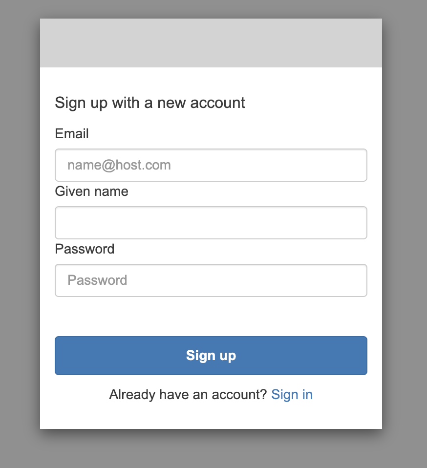
_Sign up page_

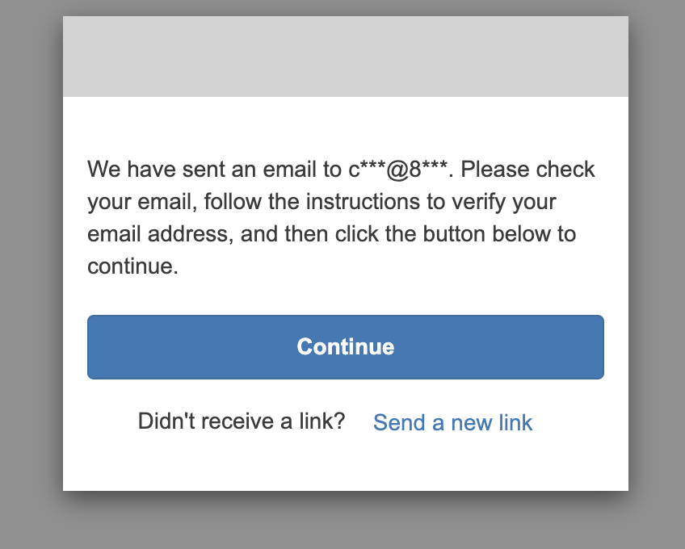
_Verification link_

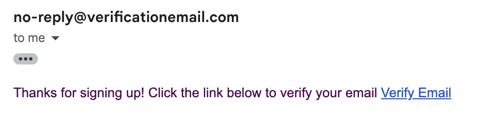
_Verification email_

**Configure Postman**

- Create a new request
- Under Authorization tab:
  - Type: OAuth 2.0
  - Grant Type: Authorization Code
  - Callback URL: https://oauth.pstmn.io/v1/callback
  - Auth URL: [CognitoDomainUrl]/oauth2/authorize
  - Access Token URL: [CognitoDomainUrl]/oauth2/token
  - Client ID: [UserPoolClientId]
  - Scope: email openid profile

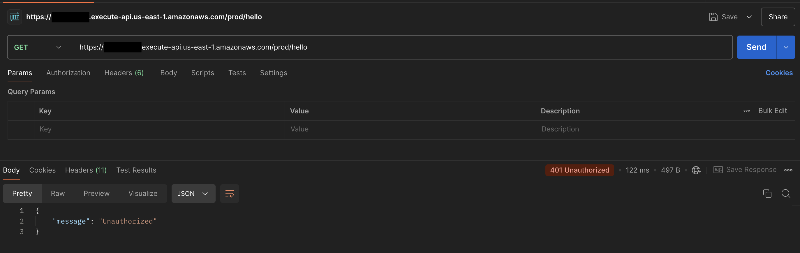
_Example of unauthorized GET request_

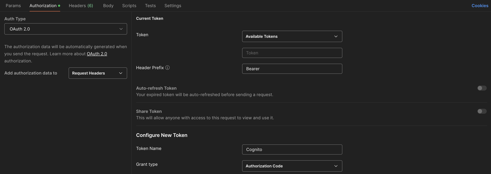
_Authorization tab with Auth Type set to OAuth 2.0_

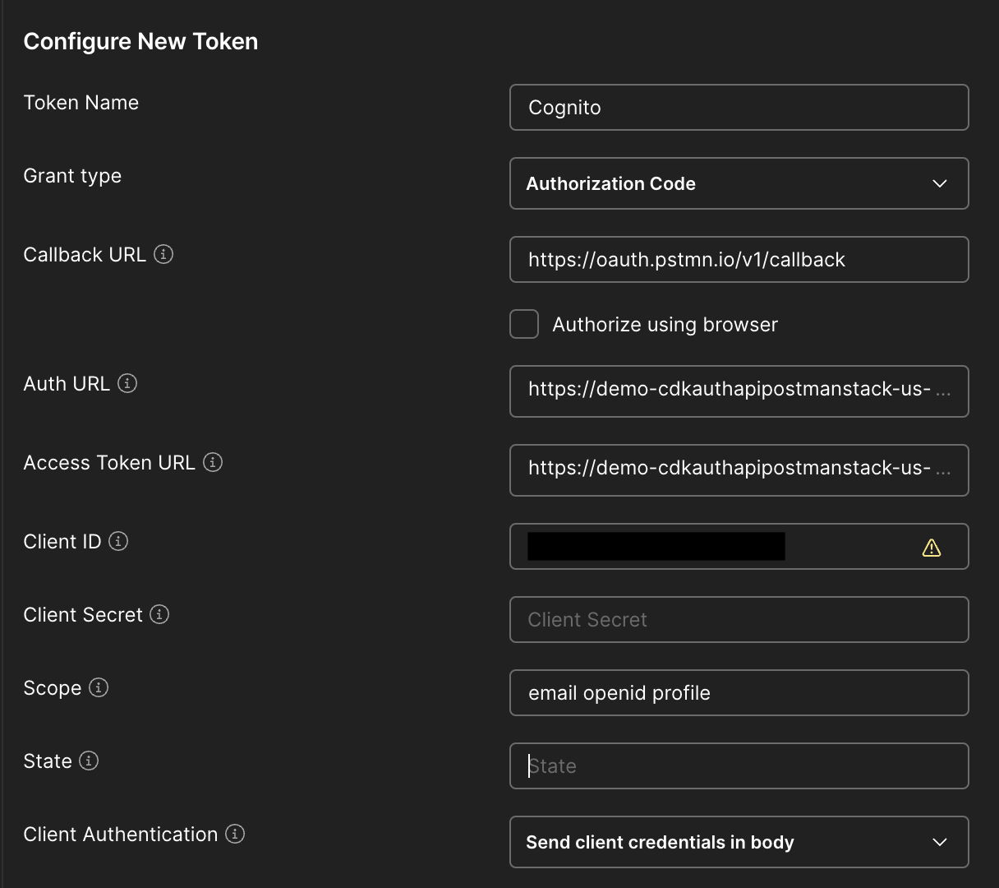
_Authorization tab Configuring new token_

**Get Access Token**

- Click "Get New Access Token"
- Log in with your Cognito credentials
- Use the token for API requests

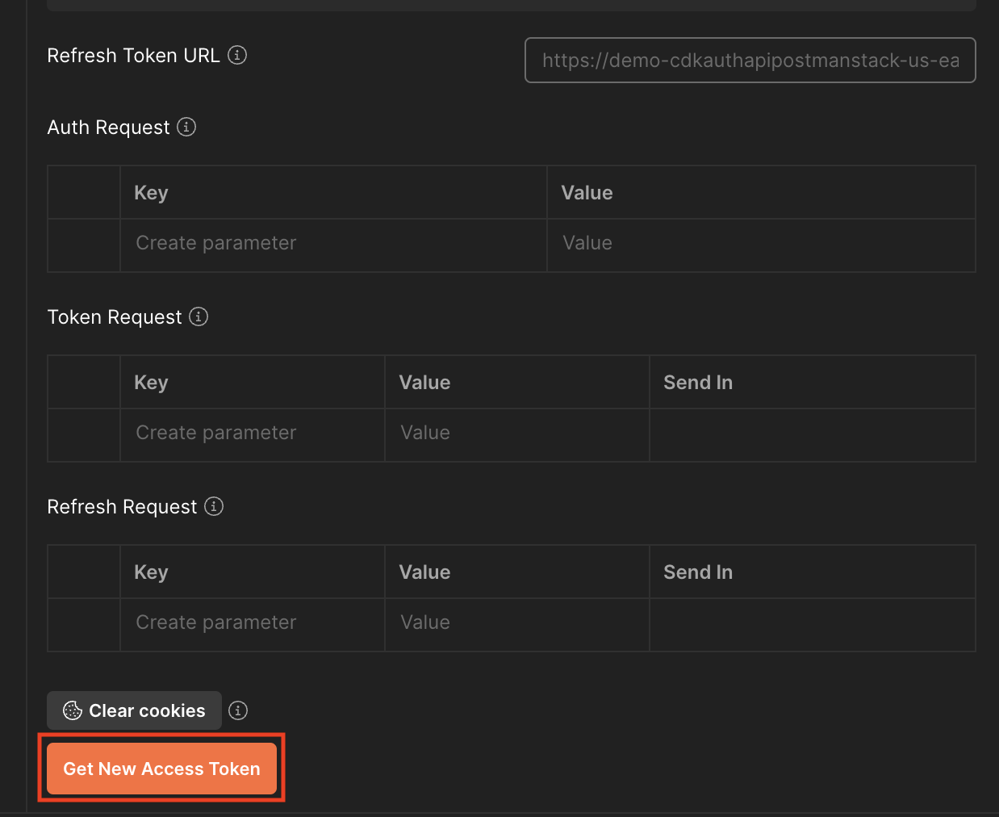
_Click "Get New Access Token"_

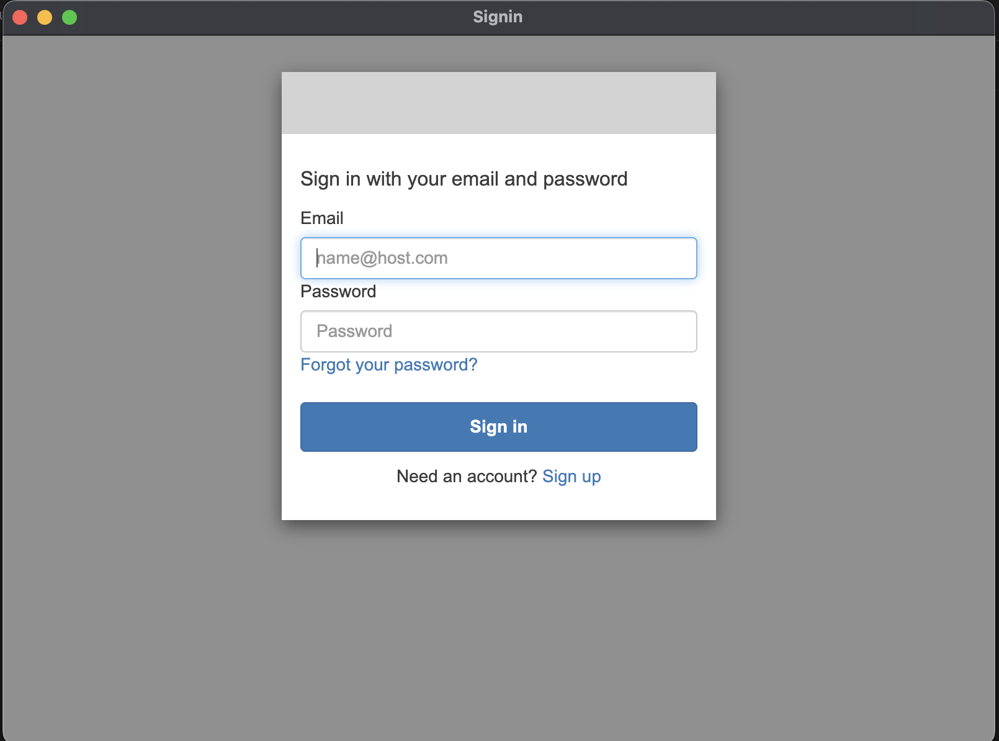
_Login popup_

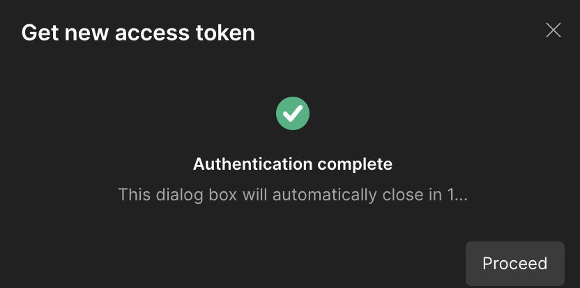
_Authentication complete_

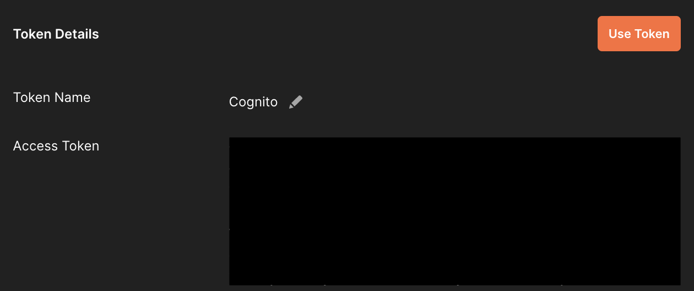
_Click "Use Token"_

**Make API Requests**

- GET [ApiUrl]/hello

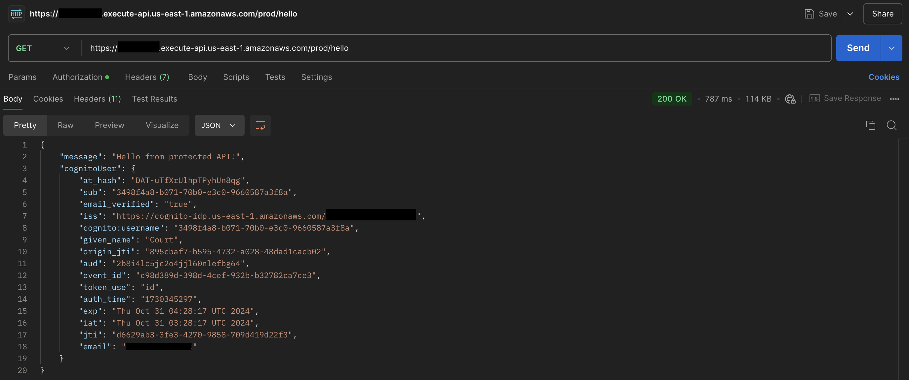
_Example of authorized GET request_

## Deployment

```bash
yarn
yarn cdk deploy
```

The deployment will output:

- Cognito Domain URL
- User Pool ID
- Client ID
- API Gateway URL
- Hosted UI URL for sign-up
- Auth URL
- Token URL

## Cleanup

```bash
yarn cdk destroy
```
